# Al-Rawdh
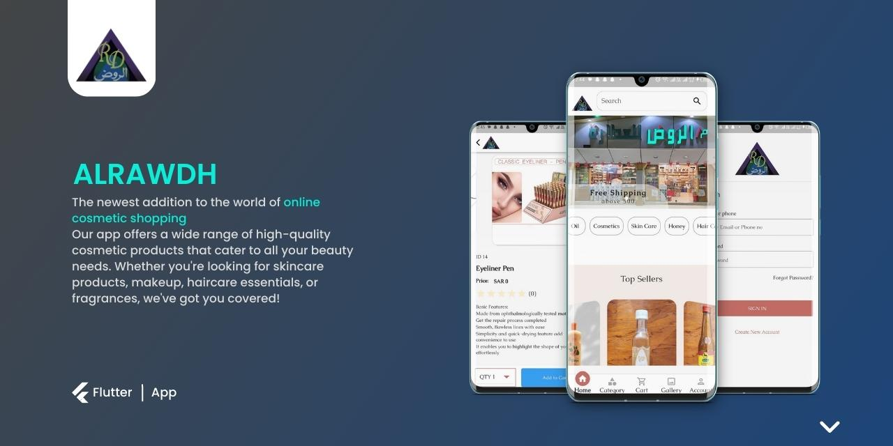

INTRODUCTION

Adva Beauty is an e-commerce store that specialises in Organic Oil products. The online store provides customers with a wide range of high-quality products from top Oil brands, making it a one-stop-shop for all Oil needs. Customers can easily browse the online store, add items to their cart, and check out securely using a variety of payment methods. Al-Rawdh also offers features such as product reviews, which allow customers to read and leave feedback on products, helping other customers make informed purchasing decisions. With its user-friendly interface, fast shipping, and extensive product selection, Al-Rawdh is a convenient and reliable option for those looking to purchase beauty and skincare products online.

AL-RAWDH FEATURES
The system has Admin & Client side. 

Admin Side Features
1. Manage Products
2. Manage Orders
3. Manage Blogs
4. View Analaytics

Client Side Features
1. View Products
2. Place Order
3. Track Order Status
4. View Blogs
5. Post Comment
6. Notifications

TECHNICALITIES/TOOLS USED
1. Flutter
2. Laravel(php) Server Side
3. SQL Database
4. Cubit State Management
5. Payment Gateway
6. REST APIs
7. Adbobe Xd(Used for UI Prototype)

APPLICATION SCREENSHOTS

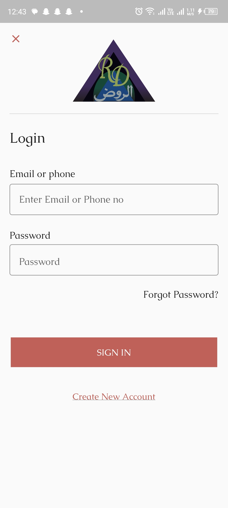 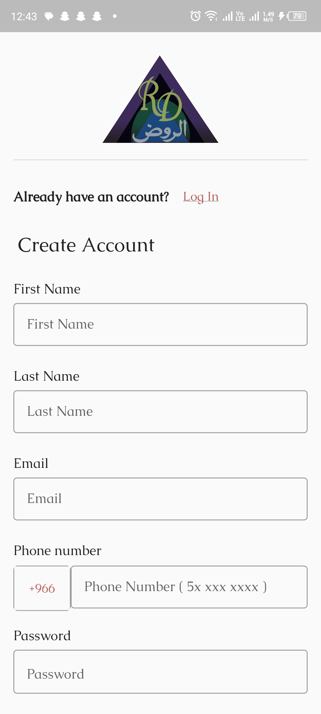 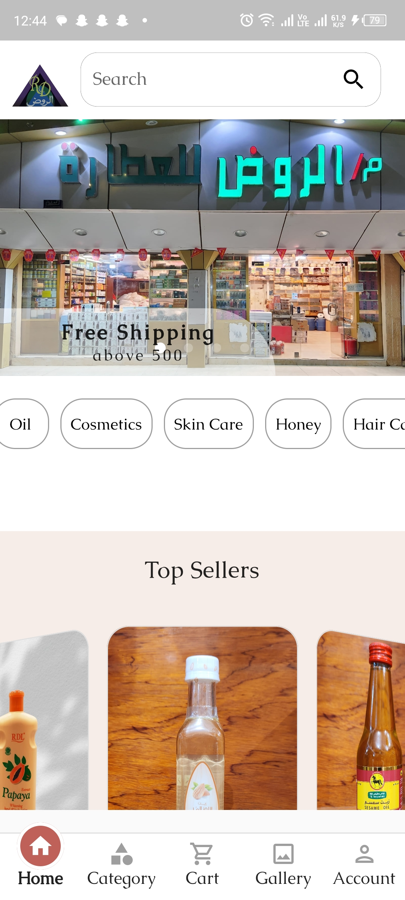 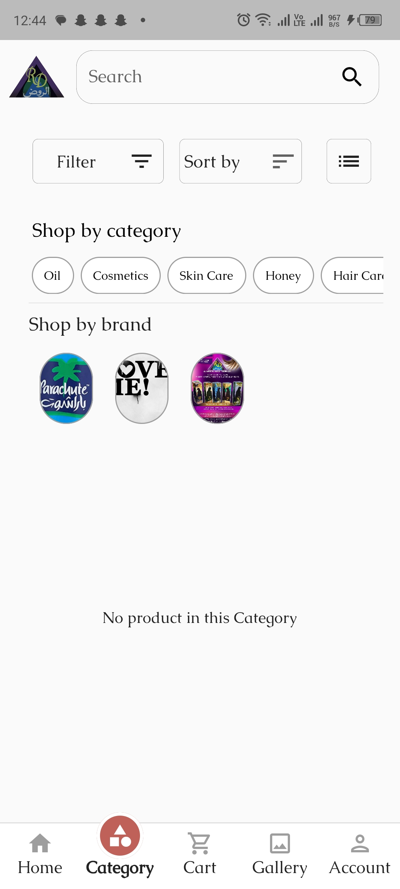 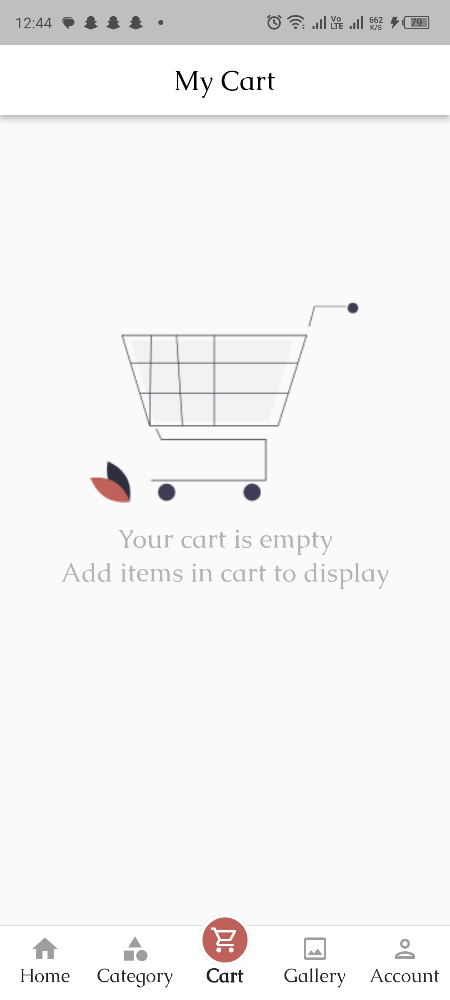 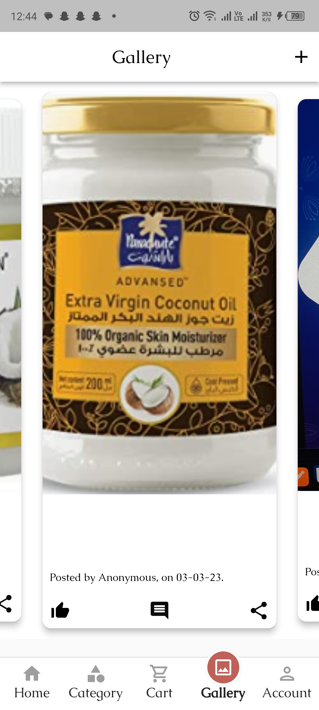 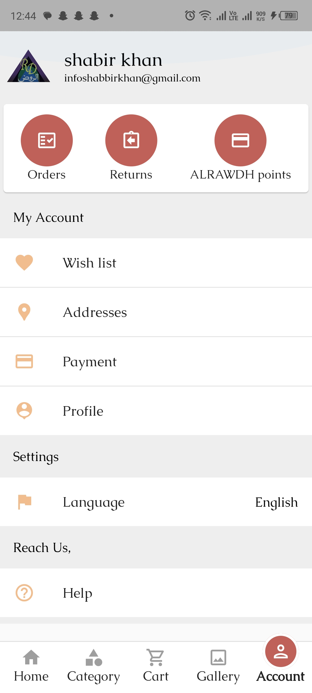 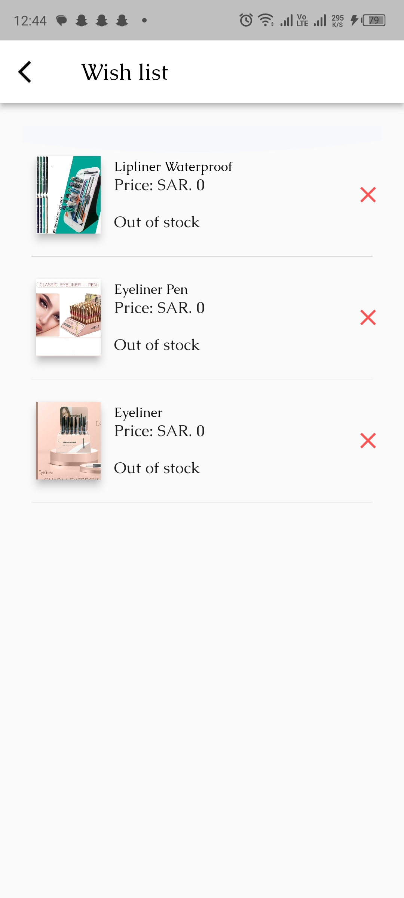 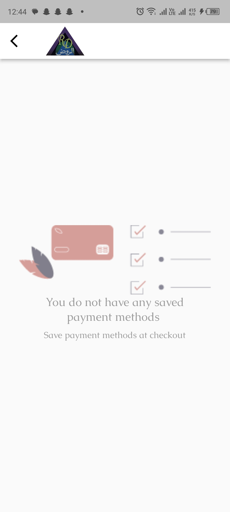 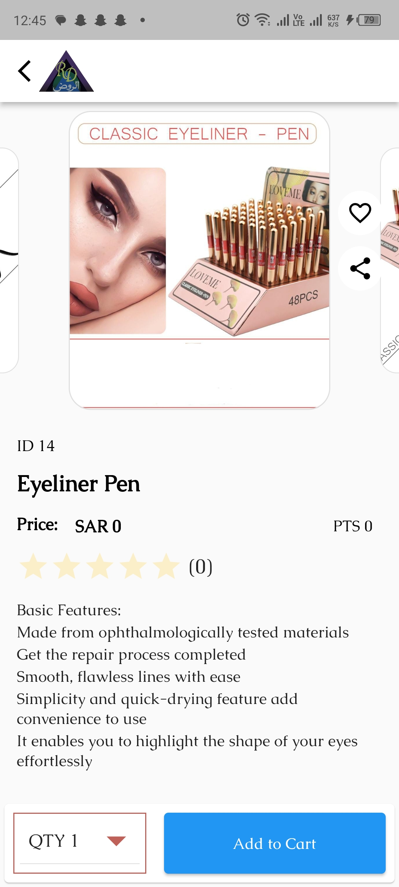

INSTALLATION GUIDE

PLAYSTORE LINK: https://play.google.com/store/apps/details?id=com.jmmtech.al_rawdh

                                                              THANKS
